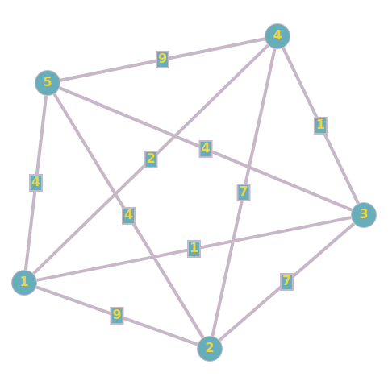
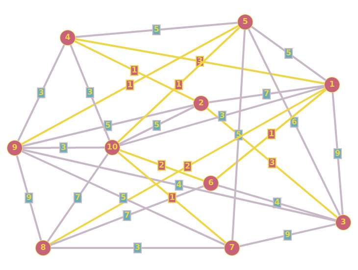

# Алгоритм Краскала
Данный алгоритм позволяет достаточно эффективно найти минимальное остовное дерево в связном графе.

## Постановка задачи
В файле `input.txt` в виде матрицы расстояний записан граф. Требуется найти минимальное остовное дерево с помощью алгоритма Краскала и вывести в файл `output.txt` суммарную длину всех его рёбер, а также сами эти рёбра.

## Псевдокод    
    G = граф
    E = список рёбер G
    удаляем все рёбра из G
    сортируем E по неубыванию длин
    T = пустой список рёбер минимального остовного дерева
    для каждого ребра e из E:
        a, b = вершины ребра e
        если a и b находятся в разных компонентах связности G:
            добавить в T ребро e
            объединить компоненты связности a и b ребром e

## Структуры данных
Ребро представлено в виде структуры, где `a` и `b` это вершины, которые ребро соединяет, а `l` это длина ребра.
```cpp
struct Edge {
    int a, b, l;
    ...
};
```
Изначальный граф и остовное дерево будем хранить в виде списков рёбер `std::vector<Edge>`. Для проверки и объединения компонент связности будем использовать СНМ, которая представлена в коде классом `DSU`.
```cpp
class DSU {
private:
    std::vector<int> parent, rank;
    int size = 0;
    ...
public:
    ...
    void make_set(int x) { ... }
    int find_set(int x) { ... }
    void union_sets(int a, int b) { ... }
};
```
## Как запустить
Первым делом нужно склонировать репозиторий
```sh
git clone git@github.com:zcimrn/kruskal
cd kruskal
```
После чего собрать с помощью `make`
```sh
make
```
Так как программа планирует читать граф из `input.txt`, необходимо его сгенерировать
```sh
./gen_test
```
После чего запускаем саму программу
```sh
./kruskal
```
Отлично, теперь правильный ответ записан в `output.txt`

## Тесты
`input.txt`
```
5
0 9 1 2 4
9 0 7 7 4
1 7 0 1 4
2 7 1 0 9
4 4 4 9 0
```
`output.txt`
```
10
1 3
3 4
1 5
2 5
```

`input.txt`
```
10
0 7 9 3 5 1 0 2 0 3
7 0 3 1 0 0 0 0 5 5
9 3 0 0 6 4 9 0 4 0
3 1 0 0 5 0 0 0 3 3
5 0 6 5 0 0 5 0 1 1
1 0 4 0 0 0 0 7 0 2
0 0 9 0 5 0 0 3 5 1
2 0 0 0 0 7 3 0 9 7
0 5 4 3 1 0 5 9 0 3
3 5 0 3 1 2 1 7 3 0
```
`output.txt`
```
15
1 6
2 4
5 9
5 10
7 10
1 8
6 10
1 4
2 3
```

